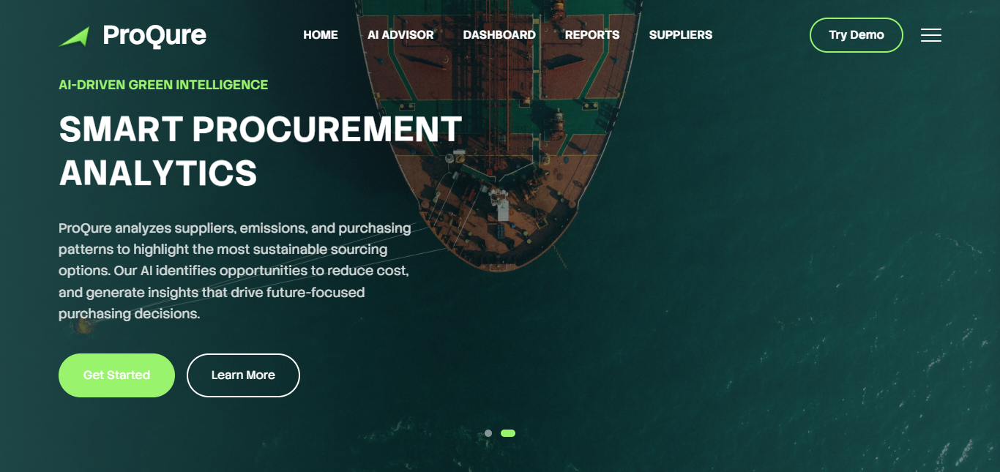
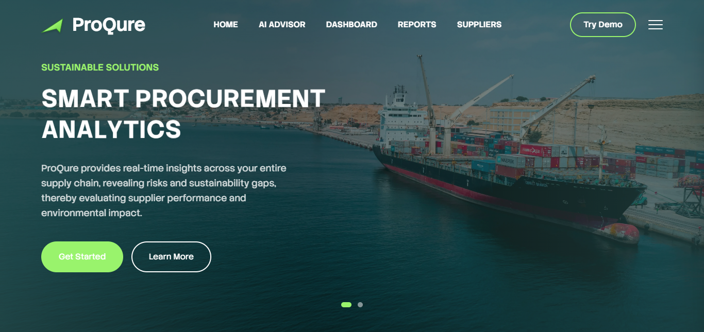
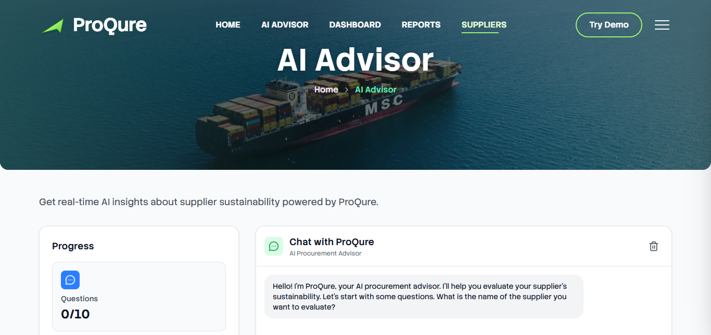
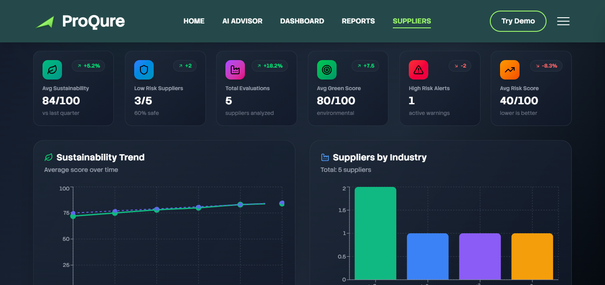
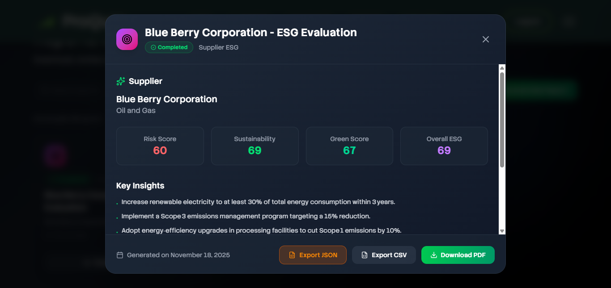
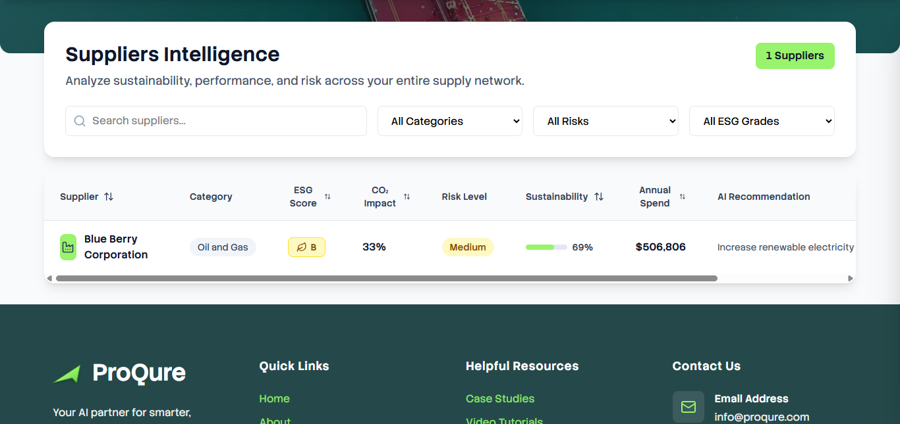

# 🚀 ProQure - AI-Powered Procurement & Sustainability Assistant

## 📋 Overview

### 🔍 The Problem

Modern procurement teams struggle with fragmented data, manual supplier evaluations, limited ESG visibility, and lack of real-time insights into spend patterns, carbon emissions, and supplier risk profiles—leading to inefficient decision-making and sustainability blind spots.

### ✨ The Solution

ProQure is a full-stack procurement analytics platform that leverages AI (LLMs) to automatically extract key insights, generate intelligent supplier evaluations, analyze CO₂ emissions, and visualize procurement performance metrics across spend categories, ESG scorecards, and supplier risk profiles.

_Transforming procurement insights with automated analytics, ESG transparency, and supplier intelligence._

## ✨ Features

### 🔍 AI Advisor & Data Analysis

A conversational interface that guides users through a comprehensive supplier evaluation process, collecting data on metrics ranging from delivery reliability to carbon emissions and labor practices.

- **Automatically generates:**

  - Metrics summary (spend, ESG, diversity, CO₂)
  - Supplier risk assessments
  - ESG scorecards
  - Spend distribution breakdown
  - Monthly CO₂ trends
  - Strategic insights for decision makers

### 📈 Interactive Dashboard

A dynamic analytics interface that gives procurement teams real-time visibility into supplier insights.

- **At-a-Glance Metrics**

  - Average ESG Score
  - CO₂ footprint
  - Supplier diversity percentages
  - Total evaluated suppliers
  - Risk level summaries

- **Rich Data Visualizations (Recharts)**

  - Line Charts: CO₂ emissions over time
  - Bar Charts: Spend categories
  - Pie Charts: Diversity distribution
  - Radar Charts: ESG performance
  - Stacked Charts: Supplier comparison metrics

- **Supplier Table**

  - Sortable and filterable
  - Supplier risk badges
  - Sustainability and performance scores
  - Progress bars for quick comparison

### 🌿 Comprehensive ESG & Risk Analysis

The AI engine evaluates each supplier and generates:

- **Risk Scores:** Quantifies supply chain vulnerabilities

- **Sustainability Scores:** Environmental and social impact ratings

- **ESG Breakdown:**

  - **Environmental:** Emissions, waste, energy usage

  - **Social:** Worker safety, diversity, ethics

  - **Governance:** Compliance, transparency, anti-corruption

These insights allow organizations to make greener, safer, and more informed procurement decisions.

### 📊 Industry Benchmarking

Suppliers are compared against:

- Industry averages

- Regional performance standards

- Typical sector ESG benchmarks

This helps organizations identify:

- Top performers
- Underperformers
- Strategic risk zones
- Opportunities for improvement

### 💡 Actionable AI Insights

The AI provides:

- Recommendations for risk mitigation

- Sustainability improvements

- Alternative supplier suggestions

- Opportunities for cost optimization

- Alerts on high-risk categories

These insights turn raw procurement data into a powerful decision-making tool.

### 📦 Export Options

- PDF report generation

- JSON export for audit teams or BI tools

- Downloadable analytics snapshots

## ⚙️ Tech Stack

### Frontend:

- **React** - Component-based UI library
- **TypeScript** - Type-safe JavaScript superset
- **TailwindCSS v4** - Utility-first CSS framework
- **Lucide React** - Modern icon library
- **React Router** - Client-side routing
- **Framer Motion** - Animation library for React
- **GSAP** - High-performance animation engine
- **React Hook Form** - Form validation and handling
- **React Icons** - Icon component library
- **AOS (Animate on Scroll)** - Scroll-triggered animations
- **Recharts** - Composable charting library
- **Date FNS** - Modern date utility library

### Server:

- **Node.js** - JavaScript runtime environment
- **Express** - Web application framework
- **MongoDB** - NoSQL database
- **Axios** - HTTP client for API requests
- **Mongoose** - MongoDB object modeling
- **Cors** - Cross-origin resource sharing
- **Bcrypt** - Password hashing
- **JWT (JSON Web Token)** - Secure authentication
- **Dotenv** - Environment variable management
- **Nodemon** - Auto-restart development server

### AI

- **Hugging Face Router API** - AI model inference gateway

- **Model**: `openai/gpt-oss-120b:together` - Open-source language model

- **Structured JSON prompt engineering** - Controlled AI response formatting

## 🔗 Demo

**[Live Demo](https://proqure.vercel.app)** - Explore the full application in action

**[Pitch Deck](https://www.canva.com/design/DAG5Dze8RTY/zZh23Fn-eCK8Ng0ZSWRQAQ/edit?utm_content=DAG5Dze8RTY&utm_campaign=designshare&utm_medium=link2&utm_source=sharebutton)** - View the project presentation and overview

## 📁 Project Structure

```
Procure/
├── backend/
│   ├── config/          # Database and environment configuration
│   ├── controllers/     # Request handlers and business logic
│   ├── models/          # MongoDB schemas and data models
│   ├── routes/          # API endpoint definitions
│   └── server.js        # Express server entry point
│
└── frontend/
    ├── public/          # Static assets and index.html
    └── src/
        ├── animations/  # Animation configurations and utilities
        ├── assets/      # Images, fonts, and media files
        ├── components/  # Reusable React components
        ├── context/     # React Context API providers
        ├── pages/       # Route-level page components
        ├── services/    # API calls and external integrations
        └── utils/       # Helper functions and utilities
```

## 📡 API Reference

### Base URL

```
http://localhost:5000/api
```

---

### Authentication

#### Register User

```http
POST /api/auth/signup
```

| Body Field | Type     | Description                      |
| :--------- | :------- | :------------------------------- |
| `email`    | `string` | **Required**. User email address |
| `password` | `string` | **Required**. User password      |
| `name`     | `string` | **Required**. User full name     |

#### Login User

```http
POST /api/auth/login
```

| Body Field | Type     | Description                      |
| :--------- | :------- | :------------------------------- |
| `email`    | `string` | **Required**. User email address |
| `password` | `string` | **Required**. User password      |

**Returns:** JWT token for authenticated requests

---

### AI Analysis

#### Analyze Supplier

```http
POST /api/ai/analyze
```

| Header          | Type     | Description                  |
| :-------------- | :------- | :--------------------------- |
| `Authorization` | `string` | **Required**. Bearer {token} |

| Body Field | Type     | Description                            |
| :--------- | :------- | :------------------------------------- |
| `supplier` | `object` | **Required**. Supplier data to analyze |

**Returns:** AI-generated supplier analysis and insights

---

### Reports

#### Get All Reports

```http
GET /api/reports
```

| Header          | Type     | Description                  |
| :-------------- | :------- | :--------------------------- |
| `Authorization` | `string` | **Required**. Bearer {token} |

**Returns:** Array of all procurement reports

#### Get Report by ID

```http
GET /api/reports/${id}
```

| Header          | Type     | Description                  |
| :-------------- | :------- | :--------------------------- |
| `Authorization` | `string` | **Required**. Bearer {token} |

| Parameter | Type     | Description                      |
| :-------- | :------- | :------------------------------- |
| `id`      | `string` | **Required**. Report ID to fetch |

**Returns:** Detailed report data for specified ID

#### Get Suppliers List

```http
GET /api/reports/suppliers/list
```

| Header          | Type     | Description                  |
| :-------------- | :------- | :--------------------------- |
| `Authorization` | `string` | **Required**. Bearer {token} |

**Returns:** List of all registered suppliers

---

### Authentication Flow

All protected routes require a valid JWT token in the Authorization header:

```
Authorization: Bearer <your_jwt_token>
```

## 🛠️ Installation

### Prerequisites

- Node.js (v14 or higher)
- npm or yarn
- MongoDB (local or Atlas connection)

### 1️⃣ Clone the Repository

```bash
git clone https://github.com/yourusername/proqure.git
cd proqure
```

### 2️⃣ Backend Setup

```bash
cd backend
npm install
```

Create a `.env` file in the backend directory:

```env
MONGODB_URI=your_mongodb_connection_string
JWT_SECRET=your_jwt_secret_key
HUGGINGFACE_API_KEY=your_huggingface_api_key
PORT=5000
```

Start the backend server:

```bash
npm run dev
# or
npm start
```

### 3️⃣ Frontend Setup

```bash
cd ../frontend
npm install
```

Create a `.env` file in the frontend directory:

```env
VITE_API_URL=http://localhost:5000/api
```

Start the development server:

```bash
npm run dev
```

### 4️⃣ Access the Application

- **Frontend**: http://localhost:5173
- **Backend API**: http://localhost:5000

## 🔐 Environment Variables

### Backend `.env`

```env
MONGODB_URI=your_mongodb_connection_string
JWT_SECRET=your_jwt_secret_key
HF_TOKEN=your_huggingface_api_token
PORT=5000
NODE_ENV=development
```

### Frontend `.env`

```env
VITE_API_URL=http://localhost:5000/api
```

**Note:** Replace placeholder values with your actual credentials. Never commit `.env` files to version control.

## 🤝 Contributing

Contributions are always welcome!

We encourage you to:

- 🐛 Report bugs and issues
- 💡 Suggest new features or improvements
- 🔧 Submit pull requests

### Getting Started

1. Fork the repository
2. Create a feature branch (`git checkout -b feature/AmazingFeature`)
3. Commit your changes (`git commit -m 'Add some AmazingFeature'`)
4. Push to the branch (`git push origin feature/AmazingFeature`)
5. Open a Pull Request

Please adhere to this project's code of conduct and ensure all tests pass before submitting.

## 📄 License

This project is licensed under the [MIT License](LICENSE) - see the LICENSE file for details.

## 👨‍💻 Author

**Kelvin Juma**

- GitHub: [talesofcarter](https://github.com/talesofcarter)
- Project Link: [ProQure](https://github.com/talesofcarter/proqure)

## Screenshots

### Landing Page





### AI Advisor



### Dashboard



### Report



### Suppliers


